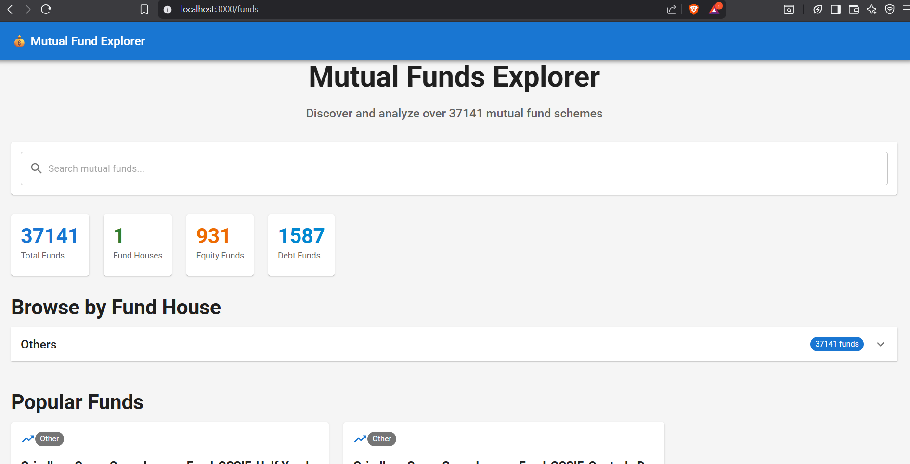
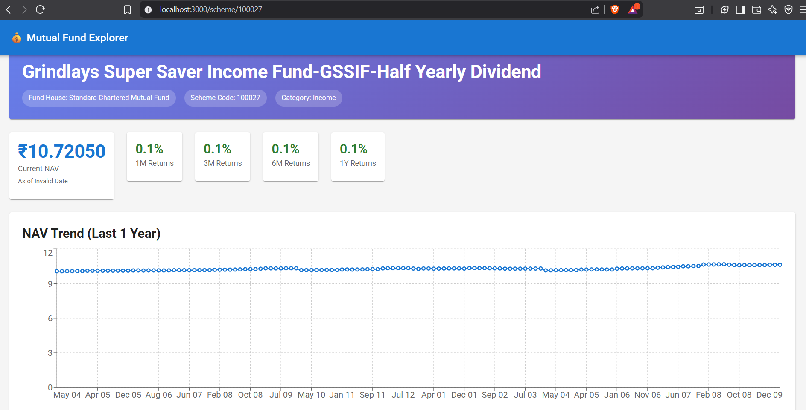

# 💰 Mutual Fund Explorer & SIP Calculator

A comprehensive Next.js application that provides advanced mutual fund analysis, SIP (Systematic Investment Plan) calculations, and investment planning tools. Built with Material-UI for a modern, responsive interface and powered by real-time mutual fund data from MFAPI.in.

<p align="left">
  <a href="https://mf-data-explorer-zfz7.vercel.app/"></a>
</p>


*Modern, intuitive home page with feature overview*

## 🚀 Features

### 📊 **Core Functionality**
- **5000+ Mutual Funds Database** - Access to comprehensive mutual fund data
- **Real-time NAV Updates** - Live Net Asset Value tracking
- **Advanced Analytics** - Performance metrics and historical analysis
- **Interactive Charts** - Beautiful visualizations using Recharts

### 🧮 **Investment Calculators**
- **SIP Calculator** - Systematic Investment Plan returns calculation
- **Lumpsum Calculator** - One-time investment analysis
- **SWP Planning** - Systematic Withdrawal Plan for retirement
- **Portfolio Analysis** - Comprehensive investment decision tools

### 📈 **Data Visualization**
- **NAV Trend Charts** - Historical performance visualization
- **Investment Growth Tracking** - SIP and lumpsum growth over time
- **Performance Metrics** - 1M, 3M, 6M, 1Y returns analysis
- **Interactive Tables** - Detailed fund information display

### 🎯 **Advanced Features**
- **Fund Search & Filtering** - Find funds by name, category, or fund house
- **Category-wise Organization** - Equity, Debt, Hybrid, ELSS classification
- **Fund House Grouping** - Browse funds by asset management companies
- **Responsive Design** - Mobile-first, cross-device compatibility

## 🛠️ Technology Stack

- **Frontend**: Next.js 13.5.1, React 18.2.0
- **UI Framework**: Material-UI (MUI) 7.3.2
- **Charts**: Recharts 3.2.1, MUI X-Charts 8.12.0
- **Styling**: Emotion, Tailwind CSS
- **Caching**: Node-Cache with 24-hour TTL
- **Data Source**: MFAPI.in public APIs
- **Date Handling**: date-fns 3.6.0

## 📋 Prerequisites

Before running this application, ensure you have:

- **Node.js** (v14 or higher)
- **npm** or **yarn** package manager
- **Git** for version control

## 🚀 Quick Start

### 1. Clone the Repository
```bash
git clone <repository-url>
cd MF_Data_Explorer
```

### 2. Navigate to Project Directory
```bash
cd project
```

### 3. Install Dependencies
```bash
npm install
# or
yarn install
```

### 4. Start Development Server
```bash
npm run dev
# or
yarn dev
```

### 5. Open Your Browser
Navigate to [http://localhost:3000](http://localhost:3000) to view the application.

## 📁 Project Structure

```
project/
├── src/
│   ├── pages/
│   │   ├── api/                 # API Routes
│   │   │   ├── mf.js           # All schemes endpoint
│   │   │   └── scheme/
│   │   │       ├── [code].js   # Scheme details
│   │   │       └── [code]/
│   │   │           ├── returns.js  # Returns calculation
│   │   │           └── sip.js      # SIP calculator
│   │   ├── index.js            # Home page
│   │   ├── funds.js            # Funds listing page
│   │   └── scheme/
│   │       └── [code].js       # Individual scheme page
│   └── lib/
│       ├── api.js              # API wrapper functions
│       └── cache.js            # Caching configuration
├── components/ui/              # Reusable UI components
├── Photos/                     # UI Screenshots
└── package.json
```

## 🔧 API Endpoints

### Core Endpoints

| Endpoint | Method | Description |
|----------|--------|-------------|
| `/api/mf` | GET | Fetch all mutual fund schemes |
| `/api/scheme/[code]` | GET | Get scheme details and NAV history |
| `/api/scheme/[code]/returns` | GET | Calculate returns for specific periods |
| `/api/scheme/[code]/sip` | POST | Calculate SIP returns |

### Query Parameters

#### Returns Endpoint
- `period`: `1m`, `3m`, `6m`, `1y` (standard periods)
- `from` & `to`: Custom date range (YYYY-MM-DD format)

#### SIP Calculator
```json
{
  "amount": 5000,
  "frequency": "monthly",
  "from": "2020-01-01",
  "to": "2023-12-31"
}
```

## 📱 Screenshots

### 🏠 Home Page

*Landing page with feature overview and navigation*

### 📊 Funds Explorer

*Comprehensive funds listing with search and filtering*

### 📈 Scheme Details & Analysis

*Individual fund analysis with performance metrics*

### 🧮 SIP Calculator

*Advanced SIP calculation with growth visualization*

## 🎯 Key Features Explained

### SIP Calculator
The SIP calculator uses historical NAV data to simulate systematic investments:

1. **Investment Simulation**: Calculates units purchased on each SIP date
2. **NAV Matching**: Finds the nearest available NAV for each investment date
3. **Growth Tracking**: Shows cumulative investment vs. current value
4. **Return Analysis**: Provides absolute and annualized returns

### Performance Analysis
- **Period Returns**: 1M, 3M, 6M, 1Y performance metrics
- **Annualized Returns**: For periods ≥ 30 days
- **NAV Visualization**: Interactive charts showing price trends
- **Risk Assessment**: Historical volatility analysis

### Data Management
- **Intelligent Caching**: 24-hour TTL for optimal performance
- **Error Handling**: Graceful fallbacks for missing data
- **Data Validation**: Ensures data integrity and accuracy

## 🔧 Configuration

### Environment Variables
Create a `.env.local` file in the project root:

```env
# Optional: Custom API endpoints
NEXT_PUBLIC_API_BASE_URL=https://api.mfapi.in/mf

# Optional: Cache configuration
CACHE_TTL=86400
```

### Customization
- **Theme**: Modify `src/pages/_app.js` for custom Material-UI theme
- **Cache Settings**: Adjust TTL in `src/lib/cache.js`
- **API Endpoints**: Update base URLs in `src/lib/api.js`

## 🚀 Deployment

### Vercel (Recommended)
1. Push code to GitHub
2. Connect repository to Vercel
3. Deploy automatically

### Other Platforms
```bash
# Build for production
npm run build

# Start production server
npm start
```

## 🤝 Contributing

1. Fork the repository
2. Create a feature branch (`git checkout -b feature/amazing-feature`)
3. Commit changes (`git commit -m 'Add amazing feature'`)
4. Push to branch (`git push origin feature/amazing-feature`)
5. Open a Pull Request

## 📝 License

This project is licensed under the MIT License - see the [LICENSE](LICENSE) file for details.

## 🙏 Acknowledgments

- **MFAPI.in** for providing comprehensive mutual fund data
- **Material-UI** for the beautiful component library
- **Recharts** for interactive data visualization
- **Next.js** team for the amazing React framework

